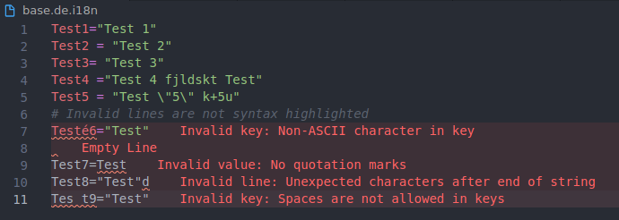
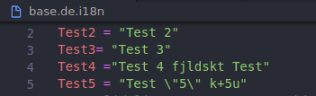
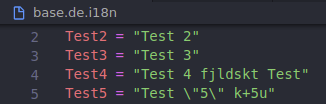

# Epsilon I18n

Support for `.i18n` files used by the Epsilon graphing calculator operating system

## Features

-   Syntax highlighting and error detection
      
    
      
-   Formatting
      Before: 
    
     After: 
    

### 1.2.1

#### Fixed

-   images

### 1.2.0

#### Added

-   Formatting

### 1.1.0

#### Added

-   Error detection

### 1.0.1

#### Fixed

-   Changelog
-   Added Icon

### 1.0.0

#### Added

-   Syntax highlighting
